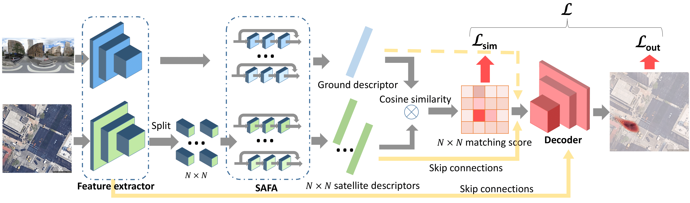

# ECCV2022: Visual Cross-View Metric Localization with Dense Uncertainty Estimates

### Abstract
This work addresses visual cross-view metric localization for outdoor robotics.
Given a ground-level color image and a satellite patch that contains the local surroundings, the task is to identify the location of the ground camera within the satellite patch.
Related work addressed this task for range-sensors (LiDAR, Radar), but for vision, only as a secondary regression step after an initial cross-view image retrieval step.
Since the local satellite patch could also be retrieved through any rough localization prior (e.g. from GPS/GNSS, temporal filtering), we drop the image retrieval objective and focus on the metric localization only.
We devise a novel network architecture with denser satellite descriptors, similarity matching at the bottleneck (rather than at the output as in image retrieval), and a dense spatial distribution as output to capture multi-modal localization ambiguities.
We compare against a state-of-the-art regression baseline that uses global image descriptors. 
Quantitative and qualitative experimental results on the recently proposed VIGOR and the Oxford RobotCar datasets validate our design.
The produced probabilities are correlated with localization accuracy,
and can even be used to roughly estimate the ground camera's heading when its orientation is unknown.
Overall, our method reduces the median metric localization error by 51\%, 37\%, and 28\% compared to the state-of-the-art when generalizing respectively in the same area, across areas, and across time. 

### Models
Our trained models can be find at: https://surfdrive.surf.nl/files/index.php/s/hcv8U9TzbfpX3lk

### Training and evaluation
Training on VIGOR dataset,  
samearea split: `python train_VIGOR.py -a same`  
crossarea split: `python train_VIGOR.py -a cross`  
Testing on VIGOR dataset,  
samearea split: `python test_VIGOR.py -a same`  
crossarea split: `python test_VIGOR.py -a cross` 

Training on Oxford RobotCar dataset:  
`python train_Oxford.py`  
Testing on Oxford RobotCar dataset:  
`python test_Oxford.py`  
